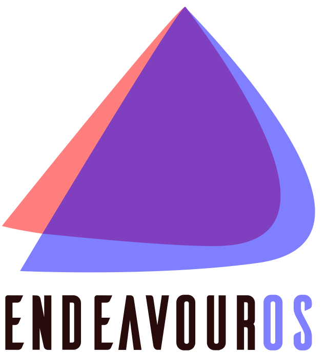

<h1 align="center">
  
</h1>

###  

***
#  A propos de moi :

- 📍 Toulouse, **_FR_**   
- 🎓 Etudiant en BUT Informatique Parcours Dev à l'université Paul Sabatier  
- ❤️ Passionné de programmation et de nouvelles technologies
- 📘 Je parle Français, Anglais et un peu Espagnol  

***

#  Ce que j'utilise :

### Logiciels :

### Je code en :

***

  

***

<!--START_SECTION:waka-->

<!--END_SECTION:waka-->
